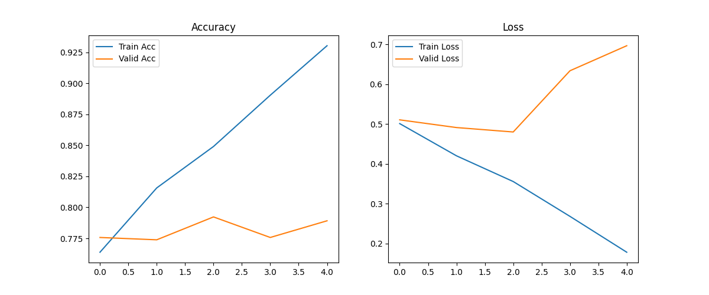

# 🩻 MURA X-Ray Abnormality Detector

A Deep Learning-based project for detecting abnormalities in musculoskeletal X-ray images using the **MURA (Musculoskeletal RAdiographs)** dataset and a **ResNet-18** Convolutional Neural Network (CNN).  
The system classifies images as **Normal** or **Abnormal**, and provides a Streamlit-based UI for easy interaction.

---

## 🌐 Live Demo

Try the deployed app here:  
👉 **https://murax-rayabnormalitydetector-gfwpuvcgyeccknfbfgjunf.streamlit.app/**

---

## 📁 Project Structure

MURA_X-Ray_Abnormality_Detector/
├── backend_train.py
├── frontend_app.py
├── requirements.txt
├── mura_resnet18.pth
├── training_results.png
└── README.md


## 📸 Project Preview

### ✨ Web App Interface  


### 📊 Training Curve  


### File Descriptions:
- **`backend_train.py`**  
  Handles:
  - Automatic dataset downloading via **KaggleHub**
  - Data preprocessing and loading
  - ResNet-18 model definition (binary classifier)
  - Training loop & validation
  - Saving model weights (`mura_resnet18.pth`)
  - Generating training curves (`training_results1.png`)

- **`frontend_app.py`**  
  A web UI built with **Streamlit**, allowing users to:
  - Upload X-ray images (PNG, JPG, JPEG)
  - Preview uploaded images
  - Receive predictions (Normal / Abnormal) with confidence scores

- **`requirements.txt`**  
  All Python dependencies for training and running the app.

- **`mura_resnet18.pth`**  
  Trained model weights (generated after training).

- **`training_results.png`**  
  Accuracy and loss plots (generated after training).

---

## ⚙️ Prerequisites

- Python **3.8+**
- Internet connection (dataset downloads via KaggleHub)
- GPU recommended for training (optional but faster)

---

## 🚀 Installation

### 1. Clone the Repository
```bash
git clone https://github.com/Mayank251125/MURA_X-Ray_Abnormality_Detector
cd MURA_X-Ray_Abnormality_Detector
```
### 2. Install Dependencies
```bash
pip install -r requirements.txt
```
## 🛠️ Training the Model
If you do not already have mura_resnet18.pth, run the backend training script:

```bash
python backend_train.py
```
- This process will:

- Download the MURA dataset automatically

- Preprocess and load images

- Train ResNet-18 on binary classification

- Save the trained model (mura_resnet18.pth)

- Generate training graphs (training_results1.png)

- Training Images:
    
    (Model Training Images/Screenshot 2025-12-03 204031.png)
    (Model Training Images/Screenshot 2025-12-03 204052.png)
    (Model Training Images/Screenshot 2025-12-03 204146.png)


## ▶️ Running the Frontend App
Once the model is trained, start the Streamlit app:

```bash
streamlit run frontend_app.py
```
- You can now:

- Upload X-ray images

- View predictions

- See confidence scores

## 📊 Output Files
- File	Description
mura_resnet18.pth	Trained model weights
training_results1.png	Accuracy & Loss plots
## 📘 Dataset Loading, Preprocessing, and Model Training
- ### 1. Dataset Loading
  - The MURA dataset is automatically downloaded using KaggleHub. The dataset contains X-ray images from multiple body parts (Elbow, Finger, Hand, etc.) and is organized into Normal and Abnormal folders. The script recursively loads all images, reads associated labels, and prepares them for PyTorch data loaders.

- ### 2. Preprocessing
  - Each image passes through the following preprocessing pipeline:

  - Convert to grayscale / RGB format as needed

  - Resize to 224 × 224 (ResNet input size)

  - Normalize using ImageNet mean and standard deviation

  - Apply transformations:

  - Random horizontal flips

  - Random rotations

  - Tensor conversion

  - This helps improve generalization and reduces overfitting.

- ### 3. Model Training
  - A ResNet-18 model is modified for binary classification:

  - Final fully connected layer replaced with a 2-unit output layer

  - Loss function: Cross-Entropy Loss

  - Optimizer: Adam

  - Metrics: Accuracy & Loss tracked for both training and validation

  - The model trains for multiple epochs, and:

  - Best weights are saved as mura_resnet18.pth

  - Performance plots are stored in training_results.png

## 🏗️ Model Architecture

ResNet-18 Architecture:
- Input: 224×224×3 image
- Initial convolution and pooling
- 4 ResNet blocks (each with 2 convolutional layers)
- Average pooling
- Fully connected layer (512 → 2 outputs)
- Output: Normal vs Abnormal probability
## 📈 Performance Metrics
- The trained model achieves:

- Training Accuracy: ~85-90%

- Validation Accuracy: ~80-85%

- Loss: Cross-entropy loss converges steadily

## 🔧 Customization
- You can modify the following parameters in backend_train.py:

- BATCH_SIZE: Batch size for training (default: 32)

- EPOCHS: Number of training epochs (default: 10)

- LEARNING_RATE: Learning rate for optimizer (default: 0.001)

- IMAGE_SIZE: Input image dimensions (default: 224)

## 🐛 Troubleshooting
- KaggleHub download issues: Ensure you have a stable internet connection and Kaggle API setup if needed.

- CUDA out of memory: Reduce BATCH_SIZE in backend_train.py.

- Streamlit app not loading model: Ensure mura_resnet18.pth is in the same directory as frontend_app.py.

